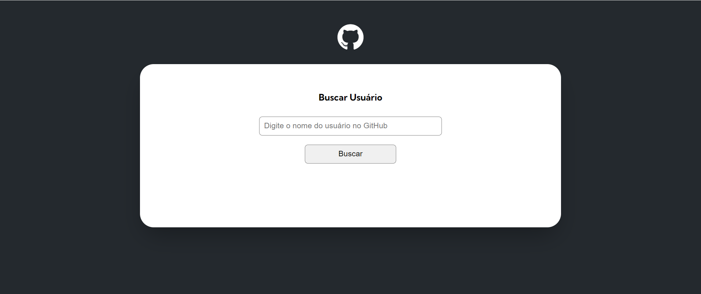

# GitHub User Info Fetcher

## Descrição

Este projeto é uma aplicação web que permite buscar e visualizar informações detalhadas de usuários do GitHub. Utilizando a API do GitHub, a aplicação apresenta dados como:

- **Nome do usuário e bio**
- **Número de seguidores e seguidos**
- **Lista de repositórios com detalhes como:**
  - Quantidade de estrelas
  - Quantidade de forks
  - Quantidade de watchers
  - Linguagem de programação usada
- **Últimos eventos do usuário no GitHub, com foco em:**
  - `PushEvent`: Mostra o nome do repositório e a mensagem de commit
  - `CreateEvent`: Exibe uma mensagem padrão "Sem mensagem de commit"

A interface é simples e responsiva, oferecendo uma visão clara das atividades e estatísticas do usuário no GitHub.

## Tecnologias Utilizadas

- **HTML5** e **CSS3**: Para a estruturação e estilização da interface.
- **JavaScript (ES6+)**: Para manipulação da DOM e requisições à API do GitHub.
- **API do GitHub**: Para obtenção de dados em tempo real sobre os usuários.

Projeto realizado em aula do curso **DevQuest** que consome a API do github usando o fetch para buscar informações dos usuários e mostrar em tela.
